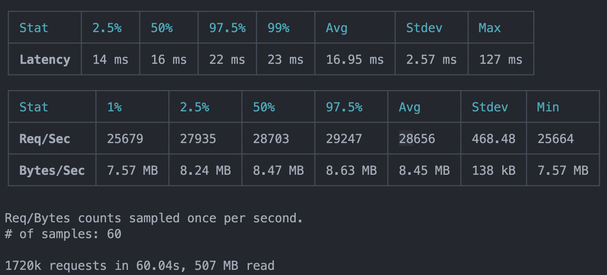
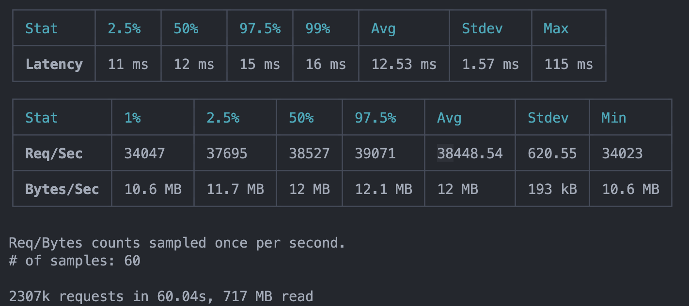
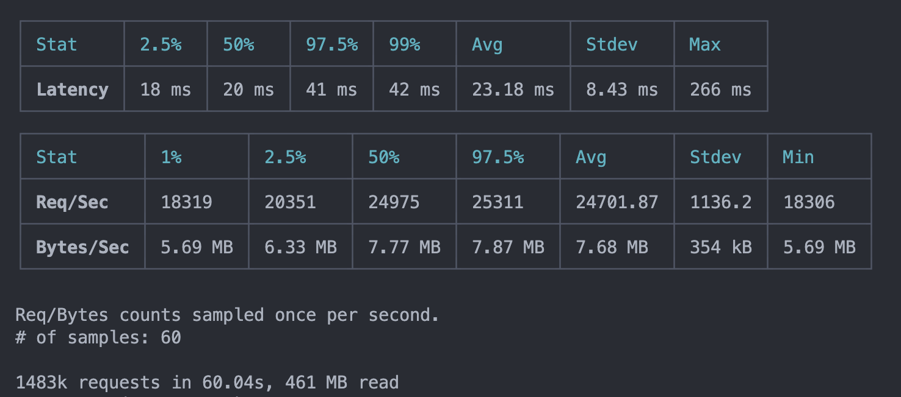

# Jwt benchmark

After some load testing, we identified some performance issues in partner-gateway. We don't have any conclusive root cause, but we suspect Event Loop Delays. This repo will compare the performance of three major libraries to sign/generate/decode [JWT](https://jwt.io/).

## Servers

- `jose-server.js` -> Uses the [jose]() library which partner gateway currently uses
- `fast-jwt-server.js` -> Uses the [@fastify/jwt](https://github.com/fastify/fastify-jwt) dependency which uses the [fast-jwt](https://github.com/nearform/fast-jwt) under the hood
- `jsonwebtoken-server.js` -> Uses the [jsonwebtoken](https://github.com/auth0/node-jsonwebtoken)

## Running

- We will be using [Clinic](https://github.com/clinicjs/node-clinic) an Open Source Node.js performance profiling suite originally developed by NearForm.
- For this benchmark we will be using the [Autocannon](https://github.com/mcollina/autocannon) to generate load and measure performance.
- And for more detail information we will be using [FlameGraph](https://www.clinicjs.org/flame/) and [Doctor](https://www.clinicjs.org/doctor/).

```sh
clinic flame --autocannon [ "/signup?payload=foo" -M POST -d 100 -c 500 ] -- node ./src/$SERVER_FILE_NAME
```

```sh
clinic doctor --autocannon [ "/signup?payload=foo" -M POST -d 100 -c 500 ] -- node ./src/$SERVER_FILE_NAME
```

## Results

### jose-server.js



### fast-jwt-server.js



### jsonwebtoken-server.js


